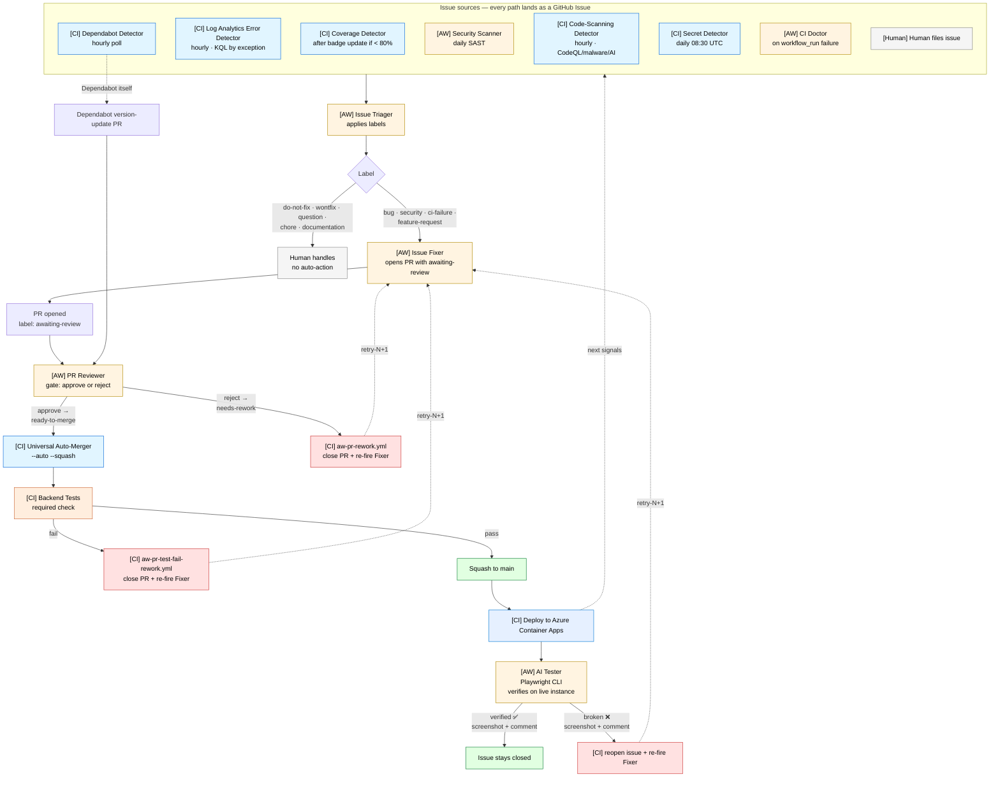
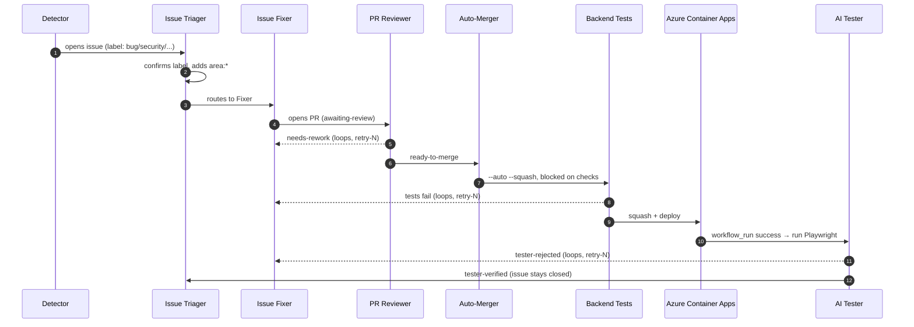

# GitHub Agentic Workflows — Demo

A working example of a **closed-loop autonomous factory** built entirely on GitHub Actions + [`gh-aw`](https://github.com/githubnext/gh-aw) (GitHub Agentic Workflows) + GitHub Copilot CLI.

The pipeline detects problems in production, files issues, proposes fixes, reviews them, gates them on tests, merges, deploys, and then verifies on the live instance — **with no human in the loop on the fast path**. Median end-to-end "Security Scanner finds an auth-bypass" → "fix is live on `main`" is about 6 minutes.

This repo is a sanitised public copy of the same pipeline running on an internal product. Cloud touchpoints (error logs, container hosting, secrets, identity) are written against **Azure** services so the demo reads cleanly for an Azure audience.

> Repo layout: every file lives in `.github/`. There is no application code in this demo — the workflows are the artifact.

---

## The loop, in one picture

Legend: **[AW]** = `gh-aw` LLM-driven workflow · **[CI]** = plain YAML GitHub Actions · **[Human]** = a person.

---

## Cloud mapping (Azure)

The original system runs partly against AWS. For this demo the cloud-side hooks are rewritten to their Azure equivalents:

| Concern | AWS (original) | Azure (this demo) |
|---|---|---|
| Application logs / exception telemetry | CloudWatch Logs | **Azure Log Analytics** workspace (Application Insights `AppExceptions` / Container Apps `ContainerAppConsoleLogs_CL`), queried with **KQL** |
| Container hosting | ECS Fargate | **Azure Container Apps** |
| Container registry | Amazon ECR | **Azure Container Registry (ACR)** |
| Secrets / config | SSM Parameter Store + Secrets Manager | **Azure Key Vault** |
| Identity & users | Cognito User Pools | **Microsoft Entra ID** (B2C for end-user pools) |
| Managed Postgres | RDS for PostgreSQL | **Azure Database for PostgreSQL — Flexible Server** |
| Object storage | S3 | **Azure Blob Storage** |
| Workflow → cloud auth | OIDC → IAM role | **OIDC → Entra ID app registration** (federated credentials, no static keys) |
| Logs query CLI used in workflows | `aws logs start-query` | `az monitor log-analytics query` |

The detector that actually touches the cloud is [`aw-error-detector.yml`](.github/workflows/aw-error-detector.yml). The rest of the pipeline is cloud-agnostic — it talks to GitHub.

---

## Workflows in this repo

Filenames carry intent: `aw-` = agentic (LLM-driven via `gh-aw`) or one of its helpers. Lock files (`*.lock.yml`) are the compiled, pinned versions that GitHub Actions actually runs — they're committed so the pipeline is reproducible.

### Agentic workflows (LLM-driven)

| File | Trigger | Purpose |
|---|---|---|
| [`aw-security-scanner.md`](.github/workflows/aw-security-scanner.md) | daily schedule | Scans backend source for secrets, SQLi, command-injection, auth-bypass, unsafe deserialization. Files issues for high-confidence findings. |
| [`aw-issue-triager.md`](.github/workflows/aw-issue-triager.md) | `issues: opened, edited` | Labels new issues (`bug` / `feature-request` / `question` / `chore` / `documentation` / `security`). |
| [`aw-ci-doctor.md`](.github/workflows/aw-ci-doctor.md) | `workflow_run: completed` (failure) | Investigates failed deploys; files diagnostic issues with root-cause analysis. |
| [`aw-issue-fixer.md`](.github/workflows/aw-issue-fixer.md) | `issues: labeled` with `security` / `bug` / `ci-failure` / `feature-request` | **Merged agent** that handles all four issue types. Opens PR with `awaiting-review`. |
| [`aw-pr-reviewer.md`](.github/workflows/aw-pr-reviewer.md) | `pull_request: opened, synchronize` | **Gate**: posts one review comment AND applies `ready-to-merge` (approve → auto-merger fires) OR `needs-rework` (reject → rework workflow re-fires Issue Fixer). |
| [`aw-ai-tester.md`](.github/workflows/aw-ai-tester.md) | `workflow_run` after Deploy (success) | Post-deploy verification on the live instance via Playwright CLI. Posts a screenshot comment confirming the fix. If broken: reopens issue, re-fires Issue Fixer. |
| [`aw-pipeline-repair.md`](.github/workflows/aw-pipeline-repair.md) | manual + watchdog | Self-repair agent for the pipeline itself — fixes broken workflows when the watchdog finds them. |

### Detectors (plain YAML — file issues into the pipeline)

| File | Trigger | Purpose |
|---|---|---|
| [`aw-error-detector.yml`](.github/workflows/aw-error-detector.yml) | hourly | Queries **Azure Log Analytics** (KQL) for grouped exception signatures over the last hour. Files (or comments on) a `bug` + `log-analytics-error` issue per new signature ≥ 5 occurrences. Dedup via signature hash in body. |
| [`aw-coverage-detector.yml`](.github/workflows/aw-coverage-detector.yml) | `workflow_run` after test-status badge | Reads the freshly-committed coverage badge; if coverage < 80%, files a `bug` + `coverage` issue. |
| [`aw-dependabot-detector.yml`](.github/workflows/aw-dependabot-detector.yml) | hourly | Polls `/dependabot/alerts` (event isn't a workflow trigger). Files `security` + `dependabot` + `do-not-fix` issue per new alert. |
| [`aw-codescan-detector.yml`](.github/workflows/aw-codescan-detector.yml) | hourly | Polls `/code-scanning/alerts` (CodeQL, malware, AI findings). Files `security` issue per new alert. |
| [`aw-secret-detector.yml`](.github/workflows/aw-secret-detector.yml) | daily 08:30 UTC | Polls `/secret-scanning/alerts`. Files `security` + `secret-leak` + `do-not-fix` issue with rotation instructions. Never auto-fixed. |
| [`aw-bundle-race-detector.yml`](.github/workflows/aw-bundle-race-detector.yml) | scheduled | Detects bundling races in PR flows where two agents race the same file. |

### Helpers (plain YAML — glue / safety rails, no LLM)

| File | Purpose |
|---|---|
| [`aw-pr-auto-merge.yml`](.github/workflows/aw-pr-auto-merge.yml) | Enables `gh pr merge --auto --squash` on any PR labeled `auto-merge` / `ready-to-merge`. |
| [`aw-pr-rework.yml`](.github/workflows/aw-pr-rework.yml) | When PR Reviewer rejects: closes PR, reopens linked issue, applies `auto-fix-retry-N`, re-fires Issue Fixer. 3-retry cap then `do-not-fix`. |
| [`aw-pr-test-fail-rework.yml`](.github/workflows/aw-pr-test-fail-rework.yml) | Same rework outcome but triggered by failing CI on a pipeline PR. Shares the retry counter. |
| [`aw-pr-requeue.yml`](.github/workflows/aw-pr-requeue.yml) | Re-queues a PR after transient infrastructure failures. |
| [`aw-issue-fixer-retry.yml`](.github/workflows/aw-issue-fixer-retry.yml) | Retries Issue Fixer on transient bundle/race failures. |
| [`aw-pipeline-watchdog.yml`](.github/workflows/aw-pipeline-watchdog.yml) | Watches for repeated workflow failures and pages Pipeline Repair. |

### `gh-aw` machinery

| File | Purpose |
|---|---|
| [`agentics-maintenance.yml`](.github/workflows/agentics-maintenance.yml) | Auto-generated by `gh-aw` — keeps the agentic system maintained. Do not edit by hand. |
| [`copilot-setup-steps.yml`](.github/workflows/copilot-setup-steps.yml) | Provisions the `gh-aw` CLI in the Copilot Agent environment. |
| [`.github/agents/agentic-workflows.agent.md`](.github/agents/agentic-workflows.agent.md) | `gh-aw`-supplied dispatcher that routes "create/update/debug workflow" requests to the right specialised prompt. |

---

## Safety rails (in pipeline order)

1. **PR Reviewer gate** — every PR with `awaiting-review` must get `ready-to-merge` from PR Reviewer before the auto-merger fires.
2. **`Backend Tests` required check** — `--auto` merges block until tests pass.
3. **AI Tester post-deploy** — Playwright verification on the live Container App. If it fails: reopen the issue.
4. **3-retry cap** — after `auto-fix-retry-3` (across all rework paths), issue gets `do-not-fix` and a human is paged.
5. **Forbidden paths** — Issue Fixer cannot touch `main.py`, existing migrations, `.github/**`, or `externals/**`.
6. **`gh-aw` firewall sandbox** — every LLM agent runs with restricted network egress (allowlist of `api.anthropic.com`, `api.github.com`, `pypi.org`, …) and no write env vars; all repo writes go through `gh-aw`'s `safe-outputs`.

---

## Required secrets / variables

To actually run this pipeline in a real repo:

| Name | Type | Purpose |
|---|---|---|
| `COPILOT_GITHUB_TOKEN` | secret | PAT with **Copilot Requests** scope. Authenticates the Copilot CLI inside the `gh-aw` firewall sandbox. |
| `GH_AW_GITHUB_TOKEN` | secret | PAT with `pull-requests: write` + `contents: write` + `security_events: read`. Used so PRs/issues are authored by a real user (bot events don't chain). |
| `AZURE_CLIENT_ID` | secret | Entra ID app registration (client ID) — federated with this repo via OIDC. |
| `AZURE_TENANT_ID` | secret | Entra ID tenant. |
| `AZURE_SUBSCRIPTION_ID` | secret | Subscription containing the Log Analytics workspace. |
| `AZURE_LOG_ANALYTICS_WORKSPACE_ID` | variable | Workspace ID (GUID) the error detector queries. |

The Entra app registration needs the `Log Analytics Reader` role on the workspace (or finer-grained `Microsoft.OperationalInsights/workspaces/query/read`).

The enterprise policy "Allow GitHub Actions to create and approve pull requests" must be enabled — otherwise `safe-outputs.create-pull-request` falls back to filing a duplicate issue.

---

## Labels the pipeline expects

If any of these are missing, `safe-outputs.add-labels` and `gh issue/pr edit --add-label` will fail silently or 404.

| Label | Applied by | Purpose |
|---|---|---|
| `bug` / `security` / `ci-failure` / `feature-request` | Triager | Issue type from Triager |
| `automated-fix` | Issue Fixer | Identifies pipeline-originated PRs |
| `awaiting-review` | Issue Fixer | PR is waiting for PR Reviewer's verdict |
| `ready-to-merge` | PR Reviewer (approve) | Universal Auto-Merger fires |
| `needs-rework` | PR Reviewer (reject) | Rework workflow closes PR + re-fires Fixer |
| `auto-merge` | Manual / certain detectors | Auto-Merger fires (bypasses the LLM gate) |
| `auto-fix-attempted` | Issue Fixer | Dedup — prevents re-firing on same issue |
| `auto-fix-retry-N` | Rework workflows | Retry counter (N = 1..3) |
| `do-not-fix` / `wontfix` | Human | Opt-out from automation |
| `tester-verified` / `tester-rejected` | AI Tester | Verification outcome on the merged PR |
| `coverage` / `log-analytics-error` / `dependabot` / `code-scanning` / `malware` / `secret-leak` | Detectors | Subcategorise the source of the bug |

Create any missing labels with `gh label create <name> --color <hex> --description "<desc>"`.

---

## Cost expectation

Per-event LLM cost via Copilot Requests quota:

| Event | Typical # / day | Per-event Copilot Requests |
|---|---|---|
| Security Scanner | 1 (scheduled) | 3–6 |
| Issue Triager | 1–5 | 1–2 |
| Issue Fixer | 1–5 | 5–15 |
| PR Reviewer | 1–10 | 2–8 |
| CI Doctor | 0–3 | 3–5 |
| AI Tester | 1–5 | 5–10 |

At normal activity (~30 events/day): **50–200 Copilot Requests/day**, comfortably within Copilot Business limits.

---

## Common failure modes

| Symptom | Cause | Fix |
|---|---|---|
| `gh-aw` workflow fails in <30s | `COPILOT_GITHUB_TOKEN` missing or wrong scope | Set/regenerate PAT with Copilot Requests scope |
| Issue Fixer creates a fallback issue instead of PR | `GH_AW_GITHUB_TOKEN` missing/wrong scope, OR enterprise PR-create policy off | Set PAT with PR-write + Contents-write; enable Actions PR creation in enterprise settings |
| `pull_request` event doesn't fire on auto-created PRs | PR authored by `github-actions[bot]` (GitHub safety: bot events don't chain) | Use a PAT for `GH_AW_GITHUB_TOKEN` so PRs are authored by a real user |
| Detector logs "Could not fetch alerts" | PAT lacks `security_events` scope or feature isn't enabled at the repo level | Regenerate PAT; enable the security feature |
| `aw-error-detector` fails with `AuthorizationFailed` | Entra app missing `Log Analytics Reader` on the workspace | Add the role assignment |
| `--auto` merges instantly with no checks | Branch protection missing required status checks | Add `Backend Tests` as a required check on `main` |
| PR keeps cycling Fixer ↔ Reviewer ↔ Fixer | Issue is genuinely ambiguous; retry cap will hit | After `auto-fix-retry-3`, `do-not-fix` auto-applies. Investigate manually. |

---

## How to disable the pipeline

| What | How |
|---|---|
| All agentic workflows | Repo → Actions → workflow → ⋯ → Disable |
| Just auto-merge | Delete `aw-pr-auto-merge.yml` |
| One specific issue from auto-fix | Apply label `do-not-fix` or `wontfix` |
| Token revocation | Revoke `COPILOT_GITHUB_TOKEN` and `GH_AW_GITHUB_TOKEN`. Workflows fail-stop. |

---

## Credits

Built on:

- [`gh-aw`](https://github.com/githubnext/gh-aw) — GitHub Agentic Workflows (the LLM-runner CLI + safe-outputs runtime).
- GitHub Copilot CLI — the agent engine inside each `aw-*` workflow.
- [`actions/azure-login`](https://github.com/Azure/login) — OIDC federation to Entra ID.

This repo is provided as a demo. It runs in production (with the AWS bindings) on an internal product — what you see here is the same pipeline, sanitised and ported to Azure.
